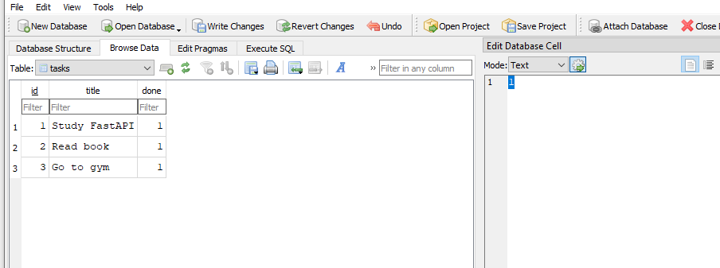

# Task API

A simple CRUD REST API built with **FastAPI** that demonstrates the basic CRUD (Create, Read, Update, Delete) operations on tasks.

---

## Features

- Create tasks
- Read all tasks
- Read a task by ID
- Update tasks
- Delete tasks
- Interactive Swagger documentation

---

## Why SQLite

SQLite was chosen for this project because:

- It is **lightweight** and requires no configuration.
- It does **not require a separate database server** to run.
- The entire database is stored in a **single local file** (`tasks.db`).
- It is well-suited for small learning projects like this one.

---

## Database

The application uses an SQLite database file called `tasks.db`, stored in the project root directory.

The database and the `tasks` table are **created automatically** when the application starts, if they do not already exist. The table schema is:

| Column | Type |
|--------|------|
| `id` | INTEGER PRIMARY KEY |
| `title` | TEXT |
| `done` | BOOLEAN |

Three sample tasks are inserted automatically when the database is first created.

---

## Installation

Install the required packages:

```bash
pip install -r requirment.txt
```

---

## Run the project

Start the FastAPI server:

```bash
uvicorn Fast:app --reload
```

The database will be created automatically on the first run.

Open Swagger UI in your browser:

```
http://127.0.0.1:8000/docs
```

---

## API Endpoints

| Method | Endpoint | Description |
|--------|----------|-------------|
| GET | `/` | Returns API information |
| GET | `/health` | Health check |
| GET | `/tasks` | Get all tasks |
| GET | `/tasks/{id}` | Get a task by ID |
| POST | `/tasks` | Create a new task |
| PUT | `/tasks/{id}` | Update an existing task |
| DELETE | `/tasks/{id}` | Delete a task |

---

## Example `curl -i`

```bash
curl -i http://127.0.0.1:8000/tasks
```

Example output:

```text
HTTP/1.1 200 OK
content-type: application/json

[
  {
    "id": 1,
    "title": "Study FastAPI",
    "done": false
  },
  {
    "id": 2,
    "title": "Read book",
    "done": true
  },
  {
    "id": 3,
    "title": "Go to gym",
    "done": false
  }
]
```

---

## SQLite Database Viewer

The SQLite database was inspected using DB Browser for SQLite.



---

## Example SQL Query

The following query was executed during Stage 4 using DB Browser for SQLite:

```sql
SELECT * FROM tasks WHERE done = 1;
```

This query returns only the completed tasks (where `done` is `1` / `true`).

---

## Stage 4 Verification

During Stage 4, the database was manually modified using DB Browser for SQLite.

For example, after running the following SQL statement:

```sql
UPDATE tasks SET done = 1;
```

the `GET /tasks` endpoint was called and confirmed that all tasks now had `done: true`. This verified that the API reads directly from the SQLite database.

---

## Swagger UI


